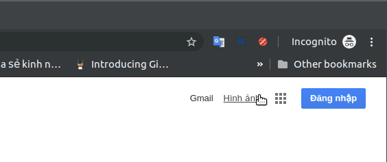
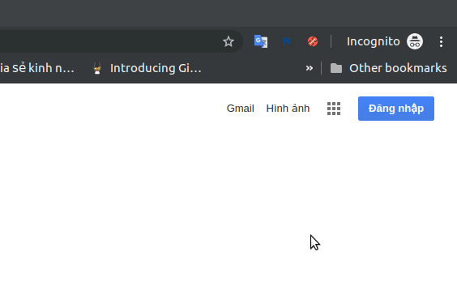
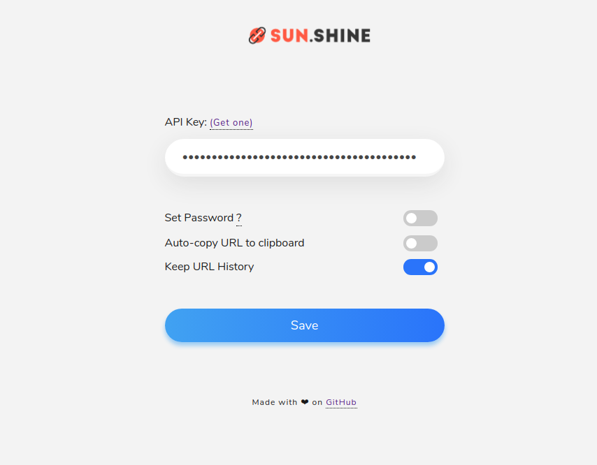

<h1 align="center">sun.shine-extension</h1>

Browser extension to shorten long URLs based on <a href="https://link.sun-asterisk.vn/">link.sun-asterisk.vn</a>

## Features

- Minimal UI
- Instant QR Code
- Cross Browser Support
- Supports Secure Passwords for URLs
- History & Incognito Feature
- Auto Copy Feature
- Free and Open Source
- Uses WebExtensions API

## Browser Support

|  |  |  |  |  |  |
 |
| --------------------------------------------------------------------------------------------------------------------------------------------------------------------------- | --------------------------------------------------------------------------------------------------------------------------------------------- | ------------------------------------------------------------------------------------------------------------------------ | --------------------------------------------------------------------------------------------------------------------------------------------------------------------------- | ------------------------------------------------------------------------------------------------------------------------------------------------------------------------ | ------------------------------------------------------------------------------------------------------------------------------------------------------------------------------ |------------------------------------------------------------------------------------------------------------------------------------------------------------------------------ |
| 49 & later ✔ | 52 & later ✔ | 36 & later ✔ | Latest ✔ | Latest ✔ | Latest ✔ | Latest ✔

## How to use

- Download for browser(s)

  - Chrome: [Sun.shine :: Chrome Web Store](https://link.sun-asterisk.vn/)
  - Firefox: [Sun.shine :: Add-ons for Firefox](https://link.sun-asterisk.vn/)
  - Opera [Sun.shine :: Opera addons](CONTRIBUTING.md#for-opera-users)
  - Edge: [Sun.shine :: Chrome Web Store](https://link.sun-asterisk.vn/)

- Generate an API Key from <a href="https://link.sun-asterisk.vn/">`https://link.sun-asterisk.vn/`</a> after signing up. (Settings page)

  

- Paste and Save this `Key` in extension's `options page` when asked.

 

## Screenshots

  
  

    

    

    

 

## Note:

- <a href="https://link.sun-asterisk.vn/">Sun.shine</a> API permits **50** URLs shortening per day using the API Key.

## Contributing and Support

View the Contributing guidelines [here](CONTRIBUTING.md).

Original Repo: [thedevs-network/kutt](https://github.com/thedevs-network/kutt)

## Show your support

Give a ⭐️ if this project helped you!

## Licence

Code released under the [MIT License](LICENSE).
